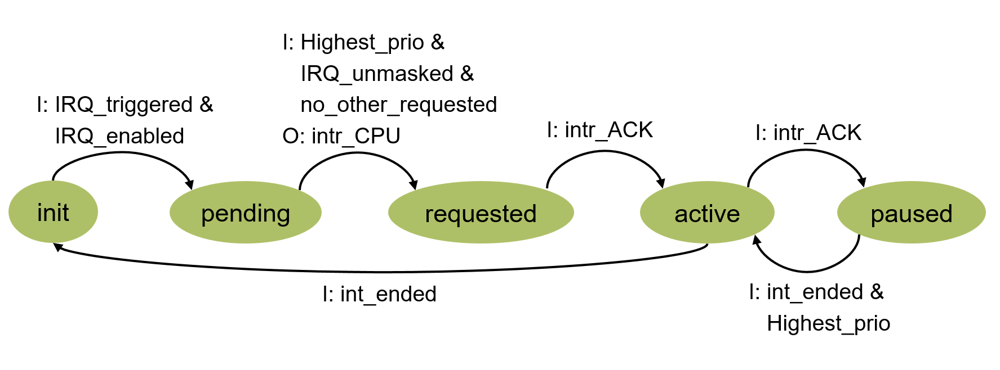

= Interrupt Controller User Documentation

Nested Interrupt Controller

=== Introduction

The nested interrupt controller collects interrupt-source inputs, records pending events, selects the highest-priority eligible source, and requests service from a processor. A higher-priority interrupt may preempt an active lower-priority interrupt only after the processor has acknowledged the current request. This request/acknowledge protocol prevents an unaccepted request from being replaced by a later request.

The interrupt controller includes an AHB-Lite interface for accessing its configuration and status registers.

The controller can exposes a vector address directly to the processor. This guide describes the common nested behavior and identifies vector-related signals where they are optional.

=== Features

** *Nested preemption:* a pending interrupt can preempt an active interrupt when it has a higher effective priority and the outstanding request has been acknowledged.

** *Dynamic priorities:* software can reassign interrupt priorities at run time through configuration registers.

** *Static trigger:* all interrupt triggers are positive edge sensitive.

** *Enable/Mask*: software can enable and mask specific interrupts. When disabled, interrupt trigger is ignored. When masked, interrupt trigger is captured and the pending bit is set, but it won’t send a request to the cpu.

** *Unique priority levels:* configured priorities must be unique, contiguous, and start at 0. Priority 0 is the highest.

** *Grouping:* interrupts are organized into groups. Priorities are unique within each group, group priorities are unique globally, and preemption is determined at group level. Interrupts within one group cannot preempt each other, priority only plays a role for tie braking scenarios, but not for preemption

** *Vectorized Address*: Interrupt Controller can be programmed with the address of every specific handler. When interrupt is requested, Interrupt Controller performs Address Resolution and forwards the handler address to the CPU.

=== Architecture

The register interface is accessed through an AHB-Lite slave interface. The interrupt controller accepts single transfers and does not support burst transfers.

===== Interface Signals

[cols="3*",options="header"]
|===
|Port
|Direction
|Description
|intr_CPU
|Output
|Interrupt request to the processor.
|nmi_CPU
|Output
|Non-Maskable Interrupt Request to the processor.
|intr_ACK
|Input
|One-cycle acknowledgement pulse from the processor. It confirms acceptance of the outstanding  interrupt  request.
|nmi_intr_ACK
|Input
|One-cycle acknowledgement pulse from the processor. It confirms acceptance of the outstanding  non-maskable  interrupt request.
|int_ended
|Input
|Completion pulse from the processor  to signal that the last requested interrupt has been serviced . It clears the active interrupt state and allows a paused  interrupt  to resume.
|nmi_ended
|Input
|Completion pulse from the processor to signal that the  non-maskable  interrupt has been serviced. It clears  the NMI status bits  allows a paused  interrupt  to resume.
|int_x
|Input
|Interrupt trigger  input.
|NMI
|Input
|Non-Maskable Interrupt trigger.
|intAddr_CPU
|Output
|Interrupt Handler Address for the Requested Interrupt forwarded to the CPU.
|===

===== Interrupt State Model

*Pending* indicates that the configured trigger condition was detected. When the winning pending source causes *intr_CPU* to assert, that source becomes *requested*. Receipt of *intr_ACK* marks it *active*. If a newly acknowledged, higher-priority source preempts it, the interrupted source becomes *paused*. An *int_ended* pulse completes the current active source; the highest-priority paused or pending source can then become active according to the same arbitration rules. 

<<<

===== Priority Resolution

The interrupts are grouped into 4 groups as shown in the table below. Each group has its own priority. 0 means higher priority. Interrupts that belong to a group with a higher priority will always preempt any interrupt from a group with a lower priority. Inside a group there is no preemption, even if the new interrupt has a higher priority than the active one. Inside a group priorities only serve to resolve racing conditions between pending interrupts.

[cols="4*",options="header"]
|===
|Group Name
|Group Default Priority
|Interrupt
|Default Priority
|Group1
|0
|int_1
|0
|
|
|int_4
|1
|
|
|int_7
|2
|
|
|int_11
|3
|
|
|int_15
|4
|
|
|int_19
|5
|
|
|int_21
|6
|
|
|int_28
|7
|Group2
|1
|int_5
|0
|
|
|int_8
|1
|
|
|int_12
|2
|
|
|int_16
|3
|
|
|int_22
|4
|
|
|int_25
|5
|
|
|int_29
|6
|
|
|int_30
|7
|Group3
|2
|int_2
|0
|
|
|int_9
|1
|
|
|int_13
|2
|
|
|int_17
|3
|
|
|int_20
|4
|
|
|int_23
|5
|
|
|int_26
|6
|
|
|int_31
|7
|Group4
|3
|int_0
|0
|
|
|int_3
|1
|
|
|int_6
|2
|
|
|int_10
|3
|
|
|int_14
|4
|
|
|int_18
|5
|
|
|int_24
|6
|
|
|int_27
|7
|===

Apart from the regular interrupts, there is an addition NON-Maskable interrupt line. The NMI has the highest global priority and it can preempt any existing interrupts. It cannot be masked, neither disabled.

=== Programming

===== Per-Source Configuration and Status

** *enable_<source>:* when implemented, enables source sampling. Clear it before changing that source's priority.

** *unmask_<source>:* determines whether a pending source participates in request generation. Masking does not stop trigger sampling.

** *priority_level_<source>:* runtime-programmable priority; 0 is highest.

** *addr_<source>:* optional handler target address for vectorized configurations.

** *pending_<source>:* trigger detected.

** *requested_<source>:* request issued to the processor.

** *active_<source>:* request acknowledged and handler currently executing.

** *paused_<source>:* previously active handler preempted by a higher-priority interrupt.

===== Register and Bitfield Reference

The `DefaultInterface` contains 48 32-bit registers. `SwRd`, `SwWr`, `HwRd`, and `HwWr` indicate whether software or hardware can read or write a field. Repeated field names use an inclusive range.

[cols="1,1,3,2,1,1,1,1,1",options="header"]
|===
|Register
|Offset
|Bitfield(s)
|Position
|Size
|SwRd
|SwWr
|HwRd
|HwWr
|enable
|0x00
|enable_int_0 ... enable_int_31
|0 ... 31
|1
|T
|T
|T
|F
|unmask
|0x04
|unmask_int_0 ... unmask_int_31
|0 ... 31
|1
|T
|T
|T
|F
|pending
|0x08
|pending_int_0 ... pending_int_31
|0 ... 31
|1
|T
|T
|T
|T
|pending_1
|0x0c
|pending_NMI
|0
|1
|T
|T
|T
|T
|active
|0x10
|active_int_0 ... active_int_31
|0 ... 31
|1
|T
|T
|T
|T
|active_1
|0x14
|active_NMI
|0
|1
|T
|T
|T
|T
|priority
|0x18
|priority_int_0 ... priority_int_9
|0, 3, 6, ..., 27
|3
|T
|T
|T
|F
|priority_1
|0x1c
|priority_int_10 ... priority_int_19
|0, 3, 6, ..., 27
|3
|T
|T
|T
|F
|priority_2
|0x20
|priority_int_20 ... priority_int_29
|0, 3, 6, ..., 27
|3
|T
|T
|T
|F
|priority_3
|0x24
|priority_int_30 ... priority_int_31
|0, 3
|3
|T
|T
|T
|F
|requested
|0x28
|requested_int_0 ... requested_int_31
|0 ... 31
|1
|T
|F
|T
|T
|requested_1
|0x2c
|requested_NMI
|0
|1
|T
|F
|T
|T
|paused
|0x30
|paused_int_0 ... paused_int_31
|0 ... 31
|1
|T
|F
|T
|T
|paused_1
|0x34
|paused_NMI
|0
|1
|T
|F
|T
|T
|group_priority
|0x38
|group_priority_Group1, group_priority_Group2, group_priority_Group3, group_priority_Group4
|0, 2, 4, 6
|2
|T
|T
|T
|F
|int_0_addr
|0x3c
|addr_int_0
|0
|32
|T
|T
|T
|F
|int_1_addr
|0x40
|addr_int_1
|0
|32
|T
|T
|T
|F
|int_2_addr
|0x44
|addr_int_2
|0
|32
|T
|T
|T
|F
|int_3_addr
|0x48
|addr_int_3
|0
|32
|T
|T
|T
|F
|int_4_addr
|0x4c
|addr_int_4
|0
|32
|T
|T
|T
|F
|int_5_addr
|0x50
|addr_int_5
|0
|32
|T
|T
|T
|F
|int_6_addr
|0x54
|addr_int_6
|0
|32
|T
|T
|T
|F
|int_7_addr
|0x58
|addr_int_7
|0
|32
|T
|T
|T
|F
|int_8_addr
|0x5c
|addr_int_8
|0
|32
|T
|T
|T
|F
|int_9_addr
|0x60
|addr_int_9
|0
|32
|T
|T
|T
|F
|int_10_addr
|0x64
|addr_int_10
|0
|32
|T
|T
|T
|F
|int_11_addr
|0x68
|addr_int_11
|0
|32
|T
|T
|T
|F
|int_12_addr
|0x6c
|addr_int_12
|0
|32
|T
|T
|T
|F
|int_13_addr
|0x70
|addr_int_13
|0
|32
|T
|T
|T
|F
|int_14_addr
|0x74
|addr_int_14
|0
|32
|T
|T
|T
|F
|int_15_addr
|0x78
|addr_int_15
|0
|32
|T
|T
|T
|F
|int_16_addr
|0x7c
|addr_int_16
|0
|32
|T
|T
|T
|F
|int_17_addr
|0x80
|addr_int_17
|0
|32
|T
|T
|T
|F
|int_18_addr
|0x84
|addr_int_18
|0
|32
|T
|T
|T
|F
|int_19_addr
|0x88
|addr_int_19
|0
|32
|T
|T
|T
|F
|int_20_addr
|0x8c
|addr_int_20
|0
|32
|T
|T
|T
|F
|int_21_addr
|0x90
|addr_int_21
|0
|32
|T
|T
|T
|F
|int_22_addr
|0x94
|addr_int_22
|0
|32
|T
|T
|T
|F
|int_23_addr
|0x98
|addr_int_23
|0
|32
|T
|T
|T
|F
|int_24_addr
|0x9c
|addr_int_24
|0
|32
|T
|T
|T
|F
|int_25_addr
|0xa0
|addr_int_25
|0
|32
|T
|T
|T
|F
|int_26_addr
|0xa4
|addr_int_26
|0
|32
|T
|T
|T
|F
|int_27_addr
|0xa8
|addr_int_27
|0
|32
|T
|T
|T
|F
|int_28_addr
|0xac
|addr_int_28
|0
|32
|T
|T
|T
|F
|int_29_addr
|0xb0
|addr_int_29
|0
|32
|T
|T
|T
|F
|int_30_addr
|0xb4
|addr_int_30
|0
|32
|T
|T
|T
|F
|int_31_addr
|0xb8
|addr_int_31
|0
|32
|T
|T
|T
|F
|NMI_addr
|0xbc
|addr_NMI
|0
|32
|T
|T
|T
|F
|===

===== Safe Software Priority Updates

Because updating interrupt priorities incorrectly can lead to race conditions and inconsistent system behavior, it is important to follow a safe procedure.

*1.* Identify every interrupt whose priority participates in the change. Because priorities must remain unique, a change normally requires swapping or rotating at least two priority values.

*2.* Disable all affected interrupts by clearing their enable controls. For a group-priority change, disable all interrupts in every affected group.

*3.* Poll the corresponding pending status bits. Do not update priorities while any affected source is pending.

*4.* If an affected source is pending but not requested, software may clear its pending state where the implementation permits. If it is already requested, wait until hardware completes the request and clears the relevant state.

*5.* Program the complete new priority permutation so that values remain unique, contiguous, and start at 0. Never leave duplicate values, even temporarily.

*6.* Re-enable the affected interrupts.
